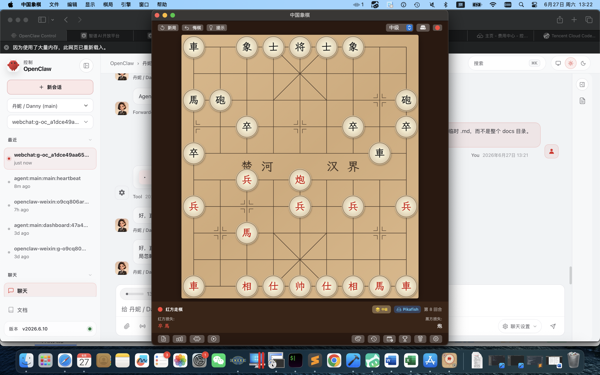

# 中国象棋 · ChineseChess

macOS / iOS 原生中国象棋应用，Swift + SwiftUI 实现，支持人机对战、棋局分析、开局浏览、题库训练与大师对局研习。

当前版本：**v5.1.0**



---

## 功能特性

- **完整规则引擎**：将/帅、士/仕、象/相、马、车、炮、兵/卒全部走法，含将帅对面、长打禁着、困毙判定
- **双 AI 引擎**：
  - 自研 Swift 引擎（negamax + Alpha-Beta 剪枝 + 置换表 + 开局库 + 残局评估 + CMA-ES 权重调优）
  - 内嵌 [Pikafish](https://github.com/official-pikafish/Pikafish) 顶级引擎（C++ 静态编译，NNUE 随包分发）
- **对局分析**：逐步评估、变化图、最佳着法推荐
- **开局浏览器**：基于 40,000+ 大师对局统计的开局树
- **题库训练**：分类谜题 + 难度评级
- **大师对局库**：预生成索引，按需加载研习
- **中英双语**：完整 i18n
- **中国风视觉**：木纹棋盘、楷体棋子、圆形棋子、走子动画与音效

## 系统要求

- macOS 14.0+ (Sonoma) / iOS 17+
- Xcode 16.0+
- [XcodeGen](https://github.com/yonsm/XcodeGen)（`brew install xcodegen`）

## 构建

```bash
# 生成 Xcode 工程并构建 Debug
xcodegen generate
xcodebuild -target ChineseChess -configuration Debug build

# Release 构建
xcodebuild -target ChineseChess -configuration Release build

# 打包 .app（输出到 releases/）
./scripts/build-release.sh
```

> ⚠️ 本项目**不再使用 SPM**（`Package.swift` 已废弃删除），请勿使用 `swift build` / `swift test`。

## 测试

```bash
# 标准测试（必须跳过 EloBaselineTests，否则 Intel Mac 必定超时）
xcodebuild test -skip-testing:EloBaselineTests

# 专项测试
xcodebuild test -only-testing:<TestClassName>

# 分批测试脚本（推荐）
./scripts/test-runner.sh
./scripts/test-batch.sh
```

> ⚠️ **铁律**：禁止不带过滤参数的全量 `xcodebuild test`。`EloBaselineTests` 是自对弈 5 局 × 30+ 分钟，会锁死构建目录。

## 架构

MVVM 架构，严格单向依赖：

```
Views (SwiftUI)
   ↓
ViewModels          — 对局编排、分析、题库
   ↓
Services            — PGN/FEN 导入导出、大师库加载、音效
   ↓
Models              — Board / MoveValidator（规则层）
   ↓
AI                  — EngineRouter 统一调度
                      ├─ AIEngine（自研 Swift）
                      └─ EmbeddedPikafishEngine（内嵌 Pikafish C API）
```

**引擎组织**：棋盘表示（`Models/Board`）→ 走法生成（`Models/MoveValidator`）→ 搜索（`AI/AIEngine`，negamax + 置换表 + 杀棋搜索）→ 评估（`AIEvaluator` + 权重表 + 局面表）。

## 目录结构

```
├── src/
│   ├── ChineseChess/          # 主源码（123 个 Swift 文件）
│   │   ├── AI/                # 双引擎、搜索、评估、开局库、调参
│   │   ├── Models/            # 棋盘、走法、规则校验、FEN
│   │   ├── Views/             # 全部 SwiftUI 视图
│   │   ├── ViewModels/        # 对局/分析/题库编排
│   │   ├── Services/          # PGN/FEN/大师库/音效
│   │   ├── Pikafish/          # Pikafish C++ 源码 + 静态库 + modulemap
│   │   ├── Accessibility/     # 无障碍
│   │   └── Resources/         # 图标、字体、音效、i18n、题库
│   └── ChineseChessTests/     # 134 个测试文件（覆盖度高于源码）
├── ChineseChess-iOS/          # iOS 工程壳 + UITests + Pikafish 源
├── data/                      # 大师对局语料（40,711 局 PGN + 索引）
├── tools/                     # 开局库构建等数据管线脚本
├── scripts/                   # 构建/打包/测试/交付脚本
├── docs/                      # 设计文档、审计、调研、归档
├── releases/                  # 历史版本 .app 归档
├── project.yml                # XcodeGen 工程定义
└── DEVTEAM.md                 # 开发规范（构建/测试/打包/版本管理铁律）
```

## 数据管线

- **开局库**：`tools/build_opening_book.py` 从大师 PGN 提取前 10 步开局序列，用 Python 复刻 Swift 的 SplitMix64 Zobrist hash 保证双端一致，输出 `opening_book_v2.json`
- **大师对局索引**：`scripts/build_master_index.py` 构建二进制偏移索引，运行时按需解析加载
- **题库难度**：`scripts/difficulty_recalc.py` 重算难度评级

## 开发规范

参与本项目开发前**必须先读 [DEVTEAM.md](DEVTEAM.md)**，核心铁律：

1. **每个 Phase 完成必须 commit + tag**，不允许攒多个 Phase 一起提交
2. 构建统一走 `xcodegen generate && xcodebuild`，不用 SPM
3. 测试必须跳过 `EloBaselineTests`
4. NNUE 文件（`pikafish.nnue`）禁止删除或移动，删除 = 引擎废掉
5. 打包产物输出到 `releases/`，永不输出到桌面

## 许可证

- 本应用代码：见仓库 LICENSE
- Pikafish 引擎：[GPLv3](https://github.com/official-pikafish/Pikafish/blob/master/Copying.txt)，以静态库方式链接，不修改其源码，仅通过 C API 调用
